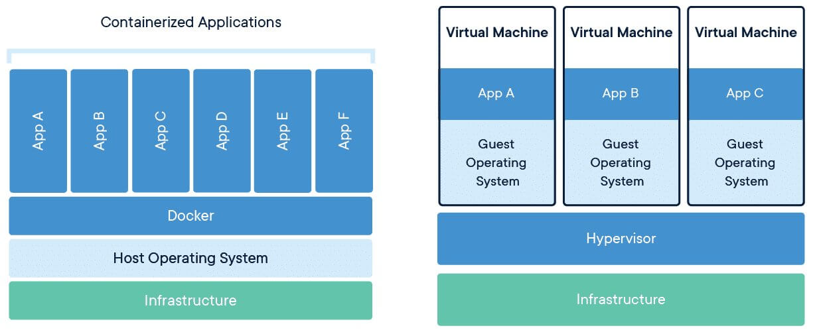

# Docker

Docker is a platform and tool that makes it easy to build, package, and run applications in containers.

Key Points about Docker:

- Container Platform → It lets you run apps in isolated environments called containers.

- Docker Images → Blueprints (app + dependencies + config).

- Docker Containers → Running instances of those images.

- Docker Engine → The runtime that actually runs containers.

- Docker Hub → A public registry to share and download images.

Why use Docker?

- Works the same on any system (no “it works on my machine” problem).

- Lightweight compared to VMs (shares host OS kernel).

- Faster development, testing, and deployment.

- Ideal for microservices and DevOps pipelines.





Left Side → Containerized Applications (with Docker)

- Infrastructure → The physical server or cloud resources.

- Host Operating System → The OS installed directly on that infrastructure.

- Docker → Container runtime sitting on top of the host OS.

- Apps (A, B, C, …) → Each app runs in its own container, but they all share the same host OS kernel.

✅ Advantages:

- Lightweight → no need for separate OS for each app.

- Faster startup.

- Less resource consumption.

- Easy to scale (run many containers).
 


Right Side → Virtual Machines (VMs with Hypervisor)

- Infrastructure → The physical server or cloud resources.

- Hypervisor → Software (like VMware, VirtualBox, KVM) that enables multiple VMs on one machine.

- Virtual Machines → Each VM contains:

    - Its own guest operating system.

    - The application on top of it.

❌ Drawbacks compared to containers:

- Heavy → Each VM duplicates a full OS.

- Slower to start.

- Consumes more memory and CPU.


Main Difference:

- Containers (Docker) → Share the host OS kernel, so they are lighter, faster, and more efficient.

- VMs → Each VM has its own guest OS, making them heavier, isolated but resource-intensive.

👉 In short:

- Docker = efficient, lightweight, fast, portable apps.

- VM = full OS isolation, but heavy and slower.

## Docker Architecture

```text
                ┌───────────────────────┐
                │   Docker CLI / API    │
                │ (docker run, build)   │
                └──────────┬────────────┘
                           │
                           ▼
                ┌───────────────────────┐
                │   Docker Daemon       │
                │   (dockerd)           │
                │  -------------------  │
                │  - Image mgmt         │
                │  - Container mgmt     │
                │  - Volumes, networks  │
                └──────────┬────────────┘
                           │
                           ▼
                ┌───────────────────────┐
                │   containerd Runtime  │
                │ (creates & runs ctrs) │
                └──────────┬────────────┘
                           │
         ┌─────────────────┴─────────────────┐
         │                                   │
 ┌──────────────┐                    ┌───────────────┐
 │ Linux Kernel │                    │   Registry    │
 │ Namespaces   │                    │ (Docker Hub,  │
 │ cgroups      │                    │  ECR, etc.)   │
 │ OverlayFS    │                    └───────────────┘
 └──────────────┘
         │
 ┌───────────────────┐
 │   Containers      │
 │ (App + deps, ISO) │
 └───────────────────┘
```


1. Docker Client (CLI / API)

- Interface where you run commands like:

    ```
    docker build
    docker run
    docker ps
    ```

- Sends requests to the Docker Daemon using REST API over:

    - UNIX socket (Linux/macOS)

    - TCP socket (remote Docker hosts)

👉 Think of it as the user’s remote control. (Docker desktop)


2. Docker Daemon (**dockerd**)

    - The server/brain of Docker, always running in the background.

    - Responsibilities:

        - Manage images (pull, build, store).

        - Manage containers (create, start, stop).

        - Manage networks & volumes.

        - Talk to container runtime (**containerd**).

    👉 It’s the orchestrator.


3. Docker Objects

    These are the building blocks managed by the daemon:

    - Image → Blueprint (read-only layers, e.g., nginx:latest).

    - Container → Running instance of an image (with writable layer on top).

    - Volume → Persistent data store.

    - Network → Communication layer between containers.

    👉 Example: “I pulled the Nginx image, started 3 containers with it, connected them to a network, and mounted a volume for logs.”


4. Container Runtime (containerd)

    - Lightweight runtime that actually creates & runs containers.

    - Uses Linux kernel features:

        - Namespaces → isolation (process, network, mounts).

        - cgroups → resource limits (CPU, memory).

        - UnionFS / OverlayFS → layers (copy-on-write).

    👉 It’s the engine inside Docker.

5. Docker Registry

    - Stores & distributes images.

    - Default = Docker Hub.

    - Enterprises use AWS ECR, GCP Artifact Registry, Harbor.

    Flow:

    1. docker pull nginx → pulls image from registry.

    2. docker push myapp → pushes image to registry.


## Images

A Docker image is a read-only template that contains:

- Your application code

- Dependencies (libraries, runtimes, etc.)

- Configuration (environment variables, startup command, etc.)

**Think of it as a blueprint for containers.**

**When you run an image → you get a container (a running instance).**

👉 Image = blueprint
👉 Container = running instance of that blueprint


### Docker Images (Internals)
1. Images are Layered Filesystems

- A Docker image is built in layers.

- Each Dockerfile instruction (FROM, RUN, COPY, etc.) creates a new read-only layer.

- Layers are stacked together using a union filesystem (OverlayFS).

- This makes images:

    - Efficient → common layers are reused across multiple images.

    - Immutable → layers don’t change once created.

👉 Example:
If you have 3 images based on ubuntu:20.04, the ubuntu:20.04 base layer is downloaded only once and shared.

### Union of Layers = Final Filesystem

When you run a container:

- Docker mounts all read-only layers from the image.

- Then adds a thin writable layer on top (container layer).

- Any changes (new files, modifications) go to this writable layer.

👉 That’s why images are read-only, but containers are read/write.


### Key Characteristics

- Immutable → Once built, an image does not change.

- Layered → Built in layers, so Docker caches them to speed up builds.

- Portable → Works the same on any system with Docker.

- Versioned → Tagged versions (e.g. nginx:1.25, nginx:latest).

- Lightweight → Shares common layers between images (saves disk space).

### Structure of a Docker Image

A Docker image has multiple layers:

- Base Layer → e.g. ubuntu:20.04, alpine:3.18.

- Dependency Layer → Libraries, frameworks, runtimes.

- App Layer → Your application code.

- Config Layer → Metadata (e.g., CMD, ENTRYPOINT, environment vars).

Each instruction in a **Dockerfile** creates a new layer.


### How Docker Images are Built

You define a Dockerfile → then build an image.

Example Dockerfile:
```
# Base layer (lightweight Linux)
FROM openjdk:17-jdk-slim

# Set working directory
WORKDIR /app

# Copy app code
COPY target/myapp.jar app.jar

# Run the application
CMD ["java", "-jar", "app.jar"]
```

Build image:
```
docker build -t myapp:1.0 .
```

Run container:
```
docker run -d -p 8080:8080 myapp:1.0
```


### Optimizing Docker Images

- Use lightweight base images (e.g., alpine, debian-slim).

- Use .dockerignore to skip unnecessary files.

- Minimize number of layers in Dockerfile.

- Multi-stage builds → build in one image, copy only needed artifacts into final image.


# Docker file
```
Dockerimage -> image -> conatiner
```

- A Dockerfile is a text file that contains a set of instructions to build a Docker image.

- Each line in a Dockerfile represents a layer in the image.

When you run:
```
docker build -t myapp .
```

Docker reads the Dockerfile, executes instructions, and creates an image.

👉 Think of it as a recipe for building containers.


## Structure of a Dockerfile

A Dockerfile usually follows this pattern:

1. Base Image
    ```
    FROM ubuntu:20.04
    ```

    - Defines the starting point (OS or existing image).

2. Maintainer / Metadata
    ```
    LABEL maintainer="akshat@example.com"
    ```

    - Info about image.

3. Install Dependencies
    ```
    RUN apt-get update && apt-get install -y python3
    ```

    - Installs software, tools, packages.

4. Copy Files
    ```
    COPY app.py /app/
    ```

    - Copies code/config into image.

5. Set Working Directory
    ```
    WORKDIR /app
    ```

    - Defines default working directory inside container.

6. Set Environment Variables
    ```
    ENV APP_ENV=production
    ```

7. Expose Ports
    ```
    EXPOSE 8080
    ```

8. Default Command
    ```
    CMD ["python3", "app.py"]
    ```

    - Defines what runs by default when the container starts.


| Instruction | Purpose                                                           |
|-------------|-------------------------------------------------------------------|
| FROM        | Base image                                                        |
| RUN         | Execute command during build                                      |
| COPY        | Copy files from host → image                                      |
| ADD         | Like COPY + supports remote URLs & tar extraction (less safe)     |
| WORKDIR     | Set working directory inside image                                |
| ENV         | Set environment variable                                          |
| EXPOSE      | Inform which port app uses                                        |
| CMD         | Default command (overridable)                                     |
| ENTRYPOINT  | Main process (harder to override than CMD)                        |
| ARG         | Define build-time variables                                       |
| LABEL       | Metadata                                                          |
| VOLUME      | Declare mount point for volumes                                   |
|


## Container

A Docker container is a running instance of a Docker image.

or 

A container is a lightweight, isolated environment to run applications.

* Docker image = blueprint (your app + dependencies + environment).

* Docker container = live, running unit created from that image.

* It packages app code + dependencies + runtime together, but shares the host OS kernel.

* Unlike VMs, containers don’t need a full guest OS → they’re much faster and smaller.

```
VM = entire house (OS, kernel, apps).

Container = separate rooms in the same house (share kernel but isolated).
```

## How Containers Work (Internals)

Containers rely on Linux kernel features:

1. Namespaces → isolation

* Process namespace → PID isolation.

* Network namespace → each container has its own IP, ports.

* Mount namespace → its own filesystem.

* UTS namespace → its own hostname.

2. cgroups (control groups) → resource limits

* Restrict CPU, memory, I/O per container.

UnionFS / OverlayFS → layered filesystem

Containers share base image layers.

Writable Copy-on-Write (COW) layer on top for modifications.

👉 Result: fast, isolated, resource-efficient apps.

## Benefits of Containers

✅ Portability (runs anywhere).\
✅ Fast startup (ms to seconds).\
✅ Efficient resource usage.\
✅ Scalability (scale in/out easily).\
✅ Consistency (works same on dev, test, prod).\
✅ Isolation (app dependencies don’t conflict).


## 9. Limitations of Containers

⚠️ Share same kernel → not as secure as full VMs.\
⚠️ Persistent storage tricky (need volumes, external storage).\
⚠️ Networking complex at scale (needs orchestration like Kubernetes).\
⚠️ Monitoring/logging harder without orchestration.

## Diagram

```
                ┌──────────────────────────┐
                │      Host OS Kernel      │
                │ (Namespaces + cgroups)   │
                └──────────┬───────────────┘
                           │
    ┌──────────────────┐   │   ┌──────────────────┐
    │   Container 1    │   │   │   Container 2    │
    │  - App + Deps    │   │   │  - App + Deps    │
    │  - COW Layer     │   │   │  - COW Layer     │
    └──────────────────┘   │   └──────────────────┘
                           │
                  Shared Base Image Layer
```


## Why containers feel like “it works on my machine”


Short answer: a container packages your app + its runtime environment + filesystem into an immutable image and runs it with kernel-level isolation (namespaces, cgroups). Because everything the app needs is inside the image (not the host), the same image produces very similar behavior on any machine that can run containers — giving the strong “it works the same everywhere” experience. Now the deeper view.


1) What a container actually packages

    A container image typically contains:

    - the application binaries/code

    - the language runtime or runtime libs (e.g., Python, JRE, glibc)

    - any OS-level files needed (lib files, config templates)

    - build-time metadata (labels, build-args)

    - the image layers (read-only) and an empty writable COW layer added when the container runs

    Because the image holds those dependencies, you avoid the “host missing library/version” problem.


## How the kernel makes it portable

Containers are processes on the host kernel, but they get strong isolation via kernel features:

1. Containers Are Just Processes (but “special”)

    - At the lowest level, a container is just a Linux process (or group of processes).

        - But that process runs in a restricted view of the world (thanks to namespaces).

        - And it has resource quotas & priorities (thanks to cgroups).

        - And it sees a layered filesystem (thanks to OverlayFS + Copy-On-Write).

    So: same app → same container image → runs same everywhere (as long as the host kernel understands these features).

2. Namespaces = Isolation (the illusion of your own machine)

    Linux namespaces partition system resources so processes think they have their own world.

    Types of namespaces containers use:

    - PID namespace

        - Each container has its own process ID tree.

        - Inside the container: PID 1 = first process of the container.

        - On the host: that same process might be PID 24678.
        👉 So when you run ps -ef inside the container, you only see your processes, not the host’s.

    - Network namespace

        - Each container gets its own network stack:

            - Its own interfaces (eth0 inside container).

            - Its own routing table.

            - Its own firewall rules.

        - Containers communicate via virtual ethernet pairs (veth) and bridges.
        👉 Feels like your own network card, even though it’s virtual.

    - Mount namespace

        - Each container gets its own filesystem view.

        - You can mount /app in one container, /data in another.

        - Host can mount drives differently.
        👉 Container thinks it owns the entire / filesystem, but it’s really a restricted mount.


    - IPC namespace

        - Isolates inter-process communication (semaphores, shared memory, message queues).

        - So containers can’t accidentally (or maliciously) talk to host processes using shared memory.


    - UTS namespace (hostname)

        - Each container can have its own hostname.
        👉 That’s why hostname inside container doesn’t return the host’s name.


3. cgroups = Resource Control

    Namespaces isolate what a process can see.\
    cgroups (control groups) isolate how much a process can use.

    - Limit CPU:
        ```
        docker run --cpus=1 myapp
        ```

        → container can’t use more than 1 CPU core.

    - Limit memory:
        ```
        docker run -m 512m myapp
        ```

        → if process exceeds 512MB → killed (OOM).

    - Limit block I/O, network bandwidth too.

    👉 Result:

    - Predictable performance.

    - One noisy container can’t starve others.

    - Makes multi-tenant clusters possible.


4. UnionFS / OverlayFS + Copy-On-Write

    Containers also need a filesystem that feels like “their own disk.” This is done with OverlayFS (Union filesystem):

    - Image layers are read-only

        - Example: nginx:latest = base OS layer + Nginx layer.

    - Writable layer on top

        - When a container starts, Docker adds a thin writable layer.

        - Any changes go here.

    - Copy-On-Write (COW)

        - If you modify /etc/config, Docker copies that file from lower read-only layers → writable layer → applies changes there.

        - Original image remains untouched.

    - Deleting files

        - Actually doesn’t delete from base image → instead, writes a whiteout marker in writable layer so container doesn’t see it anymore.

    👉 Result:

    - Containers are lightweight (no need to duplicate whole OS per container).

    - Immutable base image → multiple containers share it.

    - Only diffs are stored per container → efficient.


# Volumes

Problem Without Volumes

- By default, Docker containers are ephemeral:

- Each container gets a writable layer on top of its image (COW).

- But when the container is removed → that writable layer (and all data in it) is deleted.

- Data does not persist beyond the container’s lifecycle.

👉 This is a problem for databases, logs, configs, or any app that needs persistent data.


###  Solution → Docker Volumes

A volume is a special storage location managed by Docker.

-  outside the container’s writable layer.

- Survives container restarts, re-creation, or even removal.

- Can be shared between multiple containers.

👉 Volumes are the recommended way to persist data in Docker.


### Volume Types (Full Picture)

| Type        | Managed by Docker | Portability | Example                              |
|-------------|------------------|-------------|--------------------------------------|
| **Named**   | ✅ Yes            | ✅ High     | `-v myvol:/app`                      |
| **Anonymous** | ✅ Yes (random name) | ❌ Low     | `-v /app`                            |
| **Bind Mount** | ❌ No (host path)   | ❌ Host-dependent | `-v /host/path:/app`              |
| **tmpfs**   | In memory only   | ❌ Volatile | `--mount type=tmpfs,destination=/app/cache` |


### Types of Docker Storage
1) Volumes (best practice)

    - Managed by Docker in /var/lib/docker/volumes/.

    - Created via docker volume create or -v flag.

    - Portable across containers.

    - Can be backed by external storage drivers (NFS, cloud storage).

    Example:
    ```
    docker volume create mydata
    docker run -d -v mydata:/app/data nginx
    ```

    - ```mydata``` persists even if the container is deleted.


    #### Named vs Anonymous (Unnamed) Volumes
    Named Volume

    - Explicitly given a name.

    - Created with -v name:/path or via docker volume create.

    - Managed by Docker in /var/lib/docker/volumes/<name>/_data/.

    - Easy to share across containers.

    Example
    ```
    docker run -d -v mydata:/app/data nginx
    docker volume ls
    ```

    Output
    ```
    DRIVER    VOLUME NAME
    local     mydata
    ```
    👉 Use when you want persistent, reusable storage with a clear name.


    Anonymous (Unnamed) Volume

    - Created without a name when you just specify -v /path.

    - Docker auto-generates a random name (like 15f83e2d0...).

    - Still stored in /var/lib/docker/volumes/, but hard to track/reuse.

    - Deleted automatically if no container is using it.

    Example:
    ```
    docker run -d -v /app/data nginx
    docker volume ls
    ```

    Output:
    ```
    DRIVER    VOLUME NAME
    local     15f83e2d0b1234ab567c...
    ```

    👉 Use mostly for short-lived containers (not recommended in prod).


2. Bind Mounts

    - Directly link a host machine path to a container path.

    - Bypasses Docker’s volume management.

    - Good for development (live code editing).

    Example:
    ```
    docker run -d -v /home/akshat/app:/app nginx
    ```

    - Host /home/akshat/app → mounted into container /app.

    ⚠️ Risks:

    - Tied to host OS paths.

    - Breaks portability.


3. tmpfs Mounts

    - Data is stored in memory only (not on disk).

    - Very fast, but data disappears on container stop.

    Example:
    ```
    docker run -d --mount type=tmpfs,destination=/app/cache nginx
    ```


# Networking


## High-level picture — what Docker networking provides

- Container-to-container communication on the same host (and across hosts for overlay).

- Service discovery / name resolution (container names / network aliases).

- Port publishing / NAT so containers are reachable from the host or external clients.

- Network isolation between groups of containers.

- Multiple drivers for different use-cases: bridge, host, overlay, macvlan, none, and plugins.

Under the hood Docker uses Linux kernel features (namespaces, veth pairs, bridges, iptables/NAT) and a userspace network stack (libnetwork, plugins) to provide these.


## Core primitives & kernel bits (how it actually works)

- Network namespace: each container has its own network namespace (own interfaces, routes, ARP, firewall view).

- veth pair: Docker creates a veth pair. One end goes into container (eth0), the other end attaches to a Linux bridge on the host. Packets cross the pair.

- Linux bridge (docker0 or user-defined bridge): L2 switch on host that interconnects containers on the same host network.

- iptables / NAT: Docker programs iptables rules (nat table) to DNAT/masquerade incoming host ports to container IPs and to handle outgoing NAT from container IPs to external networks.

- Overlay networks: use an encapsulation (vxlan) and a distributed control plane (libnetwork + swarm/k/v store) to route traffic between hosts.

- Embedded DNS: Docker runs an internal DNS resolver (at 127.0.0.11 inside container) for user-defined networks, enabling name resolution for container names and network aliases.


## Network drivers — what they do and when to use them
### Bridge (default)

- Driver: bridge

- Scope: local (single host)

- Use-case: default/simple container networks on a host.

- Behavior:

    - docker0 is default legacy bridge.

    - User-defined bridge networks (docker network create -d bridge mynet) are preferred: they enable embedded DNS name resolution and better isolation.

    - Containers on same user-defined bridge can reach each other by container name and are isolated from other bridge networks.


    ```
    docker network create mynet
    docker run -d --name a --network mynet nginx
    docker run -d --name b --network mynet busybox sleep 1d
    docker exec b ping -c 2 a      # name-based connectivity
    ```
    You can create a bridge with custom subnet/gateway:
    ```
    docker network create \
    --driver bridge \
    --subnet 172.18.0.0/16 \
    --gateway 172.18.0.1 \
    mynet
    ```
    You can also set a static IP on that network when running a container:
    ```
    docker run -d --name a --network mynet --ip 172.18.0.10 nginx
    ```


### Host mode

- Driver: host (network mode)

- Scope: local

- Behavior: container shares the host network stack — no network namespace is created for the container. The container sees host IPs, ports.

- Use-case: ultra-low latency, service must bind to host interfaces, or when you need to avoid NAT overhead.

- Caveat: no port mapping (-p) needed/used; services bind directly to host ports; risk of port conflicts & less isolation.

Example:
```
docker run --rm -it --network host nginx
# nginx listens on host's interface directly
```


### None
- Driver: none

- Behavior: container gets no networking (no interfaces except loopback). Useful for highly isolated containers.


## Name resolution & service discovery

- Embedded DNS:

    - For user-defined bridge and overlay networks, Docker provides an internal DNS server at ```127.0.0.11```. Containers can resolve other containers by container name, service name, or network alias.

    - DNS lookups translate to the container IP on that network.

- /etc/hosts:

    - Docker also populates ```/etc/hosts``` with container names for containers connected to the default bridge, but user-defined networks rely on embedded DNS.

- Aliases:

    - ```--network-alias``` (or compose ```aliases```:) lets you give alternative DNS names.


## Port mapping & NAT — how external clients reach containers

- Port publish: ```-p hostPort:containerPort``` or ```-p hostIp:hostPort:containerPort```.

    - This creates NAT rules so traffic arriving at host:hostPort is DNAT'ed to container IP:containerPort.

    - Docker programs iptables (NAT PREROUTING rules and POSTROUTING MASQUERADE) to implement this, or uses userspace docker-proxy in special cases (e.g., when iptables manipulation is disabled).

    - Example:
        ```
        docker run -d -p 8080:80 nginx
        # host:8080 -> container:80
        ```

    - Publishing all ports: -P maps exposed container ports to random host ports.

    - Binding to specific host IP:
    ```
    docker run -d -p 127.0.0.1:8080:80 nginx
    ```

    binds only to localhost.

Notes about docker-proxy vs iptables:

- Docker prefers manipulating iptables rules so kernel does NAT. On some platforms/configs docker-proxy (userspace helper) is used—historically this was used on some Windows hosts or when user opts out of iptables.

Hairpin NAT:

- When a container connects to a host port that forwards back to a container on the same host, hairpin NAT matters. Docker configures rules so container->host->container loop works, but special cases (macvlan, host mode) behave differently.


## Bridge Network

- A bridge network in Docker is a private internal network created on the host.

- It connects Docker containers to each other and (optionally) to the outside world through NAT (Network Address Translation).

- By default, when you install Docker, it creates a bridge interface called docker0.

👉 Think of it like a virtual switch inside the host that links containers together.

### Types of Bridge Networks

1. Default bridge (docker0)

    - Created automatically when Docker starts.

    - All containers without an explicit --network join docker0.

    - Limitations:

        - Containers cannot resolve each other by name, only by IP.

        - Only good for simple, legacy use cases.

2. User-defined bridge networks
- Created manually with ```docker network create```.
- Advantages over default bridge:\
✅ Automatic DNS-based name resolution (ping container_name).\
✅ Better isolation (containers on different user-defined bridges cannot talk unless connected).\
✅ More control (subnets, gateways, static IPs).\
✅ Preferred for real apps & Compose setups.


### How Bridge Networking Works (Internals)

1. When Docker starts, it creates:

    - A Linux bridge interface (usually docker0).

    - A subnet (e.g., 172.17.0.0/16) and assigns IPs from it.

2. When you run a container:

    - Docker creates a veth pair (virtual ethernet cable).

    - One end goes inside the container as eth0.

    - The other end connects to the bridge (docker0 or user-defined bridge).

3. iptables rules are set up for NAT:

    - Outbound traffic is masqueraded (SNAT) to the host IP.

    - Inbound traffic from host ports (-p 8080:80) is DNAT’ed to the container IP:port.

👉 This is how containers can talk to each other locally and also reach the internet.


## more explaination on 3 point,


1. Why iptables is involved in Docker?

    - When you use Docker bridge networking, containers are on a private subnet (e.g., 172.17.0.0/16) created by docker0.

    - These IPs are not routable on your LAN/Internet.

    - So Docker must use iptables NAT rules to:

        - SNAT/Masquerade → let containers reach the outside world.

        - DNAT/Port Forwarding → let external users reach containers via host ports.


2. Outbound Traffic → SNAT (Source NAT / Masquerading)\

    Problem:

    - Container (IP 172.17.0.2) wants to access google.com.

    - Container’s private IP (172.17.0.2) is not valid on the internet.

    Solution:

    - Docker sets up an iptables MASQUERADE (SNAT) rule in the nat table.

    - This rewrites the source IP of packets leaving the host:

        - From → 172.17.0.2:12345

        - To → <host_public_ip>:54321

    Result:

    - The internet sees the packet as if it’s coming from the host’s IP.

    - Reply comes back to host → iptables rewrites destination back to 172.17.0.2.

    👉 This is how containers access the internet.


3. Inbound Traffic → DNAT (Destination NAT / Port Forwarding)\

    Problem:

    - You want external clients to reach your container’s service.

    - Container’s IP (172.17.0.2) is not reachable from outside.

    Solution:

    - When you run:
    ```
    docker run -d -p 8080:80 nginx
    ```

    - Docker installs a DNAT rule in iptables.

    - Rule says:

        - Traffic to host_ip:8080 → forward to 172.17.0.2:80.

    Flow:

    1. Client requests http://host_ip:8080.

    2. iptables DNAT rewrites:

        - From → dst=host_ip:8080

        - To → dst=172.17.0.2:80

    3. Packet delivered to container.

👉 This is how containers are exposed to the outside world.


4. Creating & Using Bridge Networks\

    Create a user-defined bridge
    ```
    docker network create mynet
    ```
    Run containers on it\
    ```
    docker run -d --name web1 --network mynet nginx
    docker run -d --name web2 --network mynet nginx
    ```
    Test connectivity
    ```
    docker exec -it web1 ping web2
    ```

✅ Works by container name (thanks to Docker’s embedded DNS).


5. Inspecting Bridge Networks
```
docker network ls
```

Output:
```
NETWORK ID     NAME      DRIVER    SCOPE
b2d7c77d7c52   bridge    bridge    local
...
```
```
docker network inspect bridge
```

Shows subnet, gateway, connected containers, IPs.


6. Assigning Static IPs

    When creating a bridge, you can define custom subnets:
    ```
    docker network create \
    --subnet=172.25.0.0/16 \
    --gateway=172.25.0.1 \
    mynet
    ```
    Run a container with static IP:
    ```
    docker run -d --name app --network mynet --ip 172.25.0.10 nginx
    ```


7. Communication Rules

    - Containers on the same bridge → can communicate freely.

    - Containers on different bridges → isolated by default.

    - Containers on bridge → host:

        - They can reach the host via gateway IP (172.17.0.1).

    - Containers → Internet:

        - Traffic SNAT’ed via host’s IP (iptables masquerading).

8. Bridge + Port Mapping

    To expose container services externally:
    ```
    docker run -d -p 8080:80 nginx
    ```

    - Host localhost:8080 → forwards to container eth0:80 (via iptables DNAT).


### 9. Default vs User-defined Bridge

| Feature                   | Default (docker0)      | User-defined Bridge ✅       |
|----------------------------|------------------------|------------------------------|
| **Name resolution (by container)** | ❌ Not supported       | ✅ Yes (via DNS)              |
| **Isolation between apps** | ❌ All share network    | ✅ Separated networks         |
| **Custom subnets/IPs**     | ❌ Not configurable     | ✅ Fully configurable         |
| **Recommended for**        | Legacy/testing         | Real apps, production        |


# Docker Compose

1. What is Docker Compose?

- Docker Compose is a tool to define and run multi-container applications using a single YAML file (docker-compose.yml).

- Instead of running multiple docker run commands manually, Compose lets you:

    - Define services (containers), networks, and volumes in YAML.

    - Start all of them with one command:
    ```
    docker-compose up
    ```

👉 Compose = Infrastructure as Code for containers (but limited to a single host, unlike Kubernetes).


2. Why Do We Need Compose?
Without Compose

- Run containers manually:
    ```
    docker run -d --name db -e POSTGRES_PASSWORD=pass postgres
    docker run -d --name app --link db -p 5000:5000 myapp
    ```

- Very tedious for multiple services.

With Compose

- Define everything in docker-compose.yml:
    ```
    services:
    db:
        image: postgres
        environment:
        POSTGRES_PASSWORD: pass
    app:
        build: .
        ports:
        - "5000:5000"
        depends_on:
        - db
    ```

Then:
    ```
    docker-compose up
    ```

Everything is created, networks handled automatically, services can reach each other by name.


3. Core Concepts in Docker Compose

1) Services

    - Define containers (apps, databases, workers).

    - Each service = one or more containers.

2) Networks

    - Compose creates an isolated network per project by default.

    - Services can communicate via service names (DNS).

3) Volumes

    - Define persistent storage across services.

4) Configuration in YAML

    - Declarative way to describe infra.


4. Typical docker-compose.yml Structure

```
version: "3.9"   # Compose file format

services:
  app:
    build: .
    ports:
      - "5000:5000"
    volumes:
      - .:/usr/src/app
    environment:
      - DB_HOST=db
    depends_on:
      - db

  db:
    image: postgres:14
    volumes:
      - dbdata:/var/lib/postgresql/data
    environment:
      - POSTGRES_PASSWORD=secret

volumes:
  dbdata:   # named volume
```


5. Key Features (in detail)

    1. Build & Run

        - Build images from Dockerfile:
            ```
            build: .
            ```

        - Or use prebuilt image:
            ```
            image: nginx:latest
            ```

    2. Networking

        - By default, all services share an isolated network (project_name_default).

        - Services can reach each other by service name (db, app).

        - You can define custom networks:

        ```
        networks:
        frontend:
        backend:
        ```

    3. Volumes (Persistence)

        - Named volumes for data:
        ```
        volumes:
        dbdata:
        ```

        - Mounted into services:
        ```
        volumes:
        - dbdata:/var/lib/mysql
        ```

    4. Environment Variables

    - You can define environment variables:
        ```
        environment:
        - APP_ENV=production
        ```

    - Or load from .env:
        ```
        DB_USER=root
        DB_PASS=secret
        ```
        ```
        env_file:
        - .env
        ```

    5. Scaling

    - Run multiple instances of a service:
        ```
        docker-compose up --scale app=3
        ```

    - Compose creates multiple containers on the same network with load balancing.

6. Commands

    - Run service-specific commands:
        ```
        command: ["python", "app.py"]
        ```

### 6. Commands in Docker Compose

Start containers:

```
docker-compose up
```


Detached mode:

```
docker-compose up -d
```

Stop containers:
```
docker-compose down
```

Rebuild + restart:
```
docker-compose up --build
```

Scale services:
```
docker-compose up --scale app=3
```

List services:
```
docker-compose ps
```

Logs:
```
docker-compose logs -f app
```


### Differences Between Docker & Docker Compose

| Feature            | Docker CLI (`docker run`)     | Docker Compose (`docker-compose.yml`)        |
|--------------------|-------------------------------|----------------------------------------------|
| **Scale multi-service?** | ❌ Manual commands            | ✅ Defined in YAML                           |
| **Networking**     | Manual `--network`            | Automatic, DNS included                      |
| **Persistence**    | Manual `-v` per run           | Declarative volumes                          |
| **Dependencies**   | Hard to manage                | `depends_on` available                       |
| **Reproducibility**| Hard to share commands        | Share `docker-compose.yml`                   |

👉 **Compose = declarative orchestration for single-host apps.**
