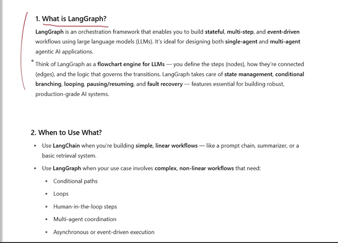
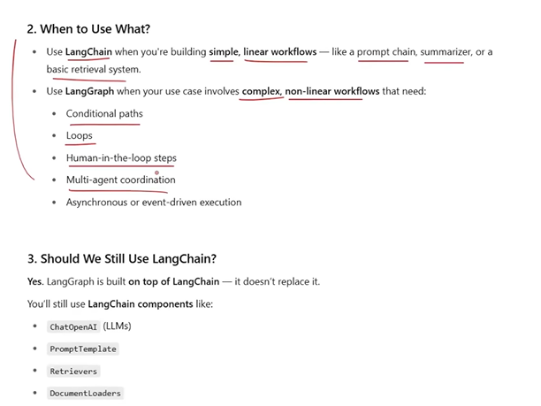
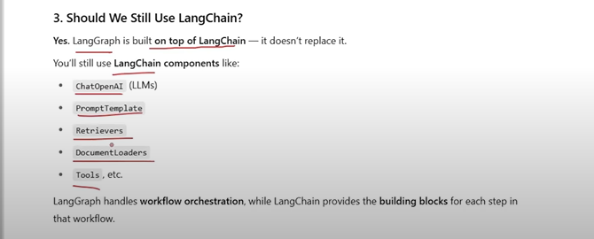

# Langraph

## Challenges in langchain

1. Control FLow Complexity

for very complex workflow like if there are loops, conditional statements and jumps in our workflow. so we need glue code(extra python code) to implement it in lang chain, as application progresses, the glue code gets increases and maintaing that will become difficult. so for creating non linear complex application in langchain is difficult. 

### Solution with langraph
- So we can implement this by langraph. langraph implement this by using graphs - it treats a task as node(simple python functions) and connect these graphs through edges (connectors).

- For conditions, in langraph we can use conditional edges, with zero glue code. and langraph will do all the things for you to solve above problem.

2. Handling State.

state is an data points and their values, for eg in the example state can be decide on j_d approved, offer status, 
onboarding_status.

state changes on every node, langchain doesn't give any option to store key value pairs of state, it given option of memory so langchain is stateless and doesnt reatin state like this.instaed we have to do it manually in langchain.

in langgraph we in starting make a state object mainly through type dict, which is accesible through every node and nodes can edit it. by this on every node we get a differnet state meaning we give input as state to node and we get output as state in node.

3. Event Driven Exceution

workflow can be - 
1. sequential
2. event driven

in langchain we uses sequential chain by this one chain do its work then other then other. until the last does it's work. this is sequential workflow.

by event driven it means that workflow can be paused and it is waiting for an exteranal trigger to happen. exteranl trigger can be time period or response.

by implementing complex workflow through langchain we again need to add gluecode, and by predenomitely langchain was decide to work with sequential chains not with event driven workflow.

lang graph is out of the box made for event driven workflow through checkpointer. and can save state until and external triger resumes it.

4. fault tolernce 

since workflow can take days to excuete and langchain doesn't provide fault tolernce by default.

by this means if your system breaks somewheer it should resume for there itself.

5. humans in the loop

langgraoh has a feature where it can wait for humans for days.

6. sub graphs can be there - fetaure

